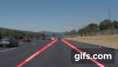

# Finding-Lane-Lines

[image1]: ./examples/grayscale.jpg "Grayscale"

The goal of this project is to make a pipeline that finds lane lines on the road.
This is a simple project performed to detect the straight lane lines for selfless driving. Script is developed in Python with OpenCV.
No complex algorithms were used but simple image processing techniques. The steps involved are as follows:
* Converting the input image to gray scale image
* Reducing the noises by Gaussian smoothening
* Detecting the edges in the image using Canny Edge Detection
* MAsking the image
* Applying Hough Tansform to mark the lane line.

Detailed script file is in`P1` Jupyter Notebook
